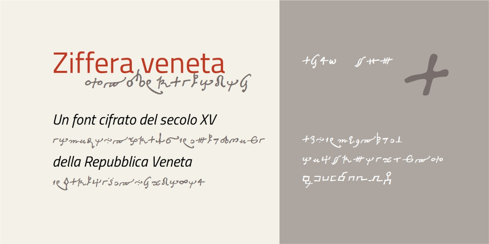

# Ziffera veneta
- Versione 1.0: versione iniziale.

Per testare il font, vedere la [pagina interattiva](https://m-casanova.github.io/Ziffera-veneta/).

## Descrizione

Il font "Ziffera veneta" è stato realizzato sulla base del cifrario (fine XV sec. - inizio XVI sec.) riportato nella *Tavola II* in L. Pasini, [*Delle scritture in cifra usate dalla repubblica veneta*](https://books.google.it/books?id=LNYEJcndrjEC&pg=PA291),
nel volume *Il R. Archivio generale di Venezia*, Venezia, P. Naratovich, 1873, pp. 291-327.

Per ogni lettera sono presenti più versioni (le varianti sono in **'ss02'**, **'ss03'** e **'ss04'**); inoltre alcune doppie hanno un simbolo specifico (**'liga'**).
er complicare la decifrazione del messaggio erano inclusi anche simboli senza significato (inseriti nel font come numeri **1-9**).

Utilizzando la caratteristica **'ss01'** il testo viene cifrato alternando le diverse versioni dei caratteri se appaiono vicini (entro 10 caratteri).

Utilizzando **'ss10'** il testo viene mostrato in chiaro con le lettere minuscole del carattere [In die busillis](https://github.com/m-casanova/In-die-busillis).
